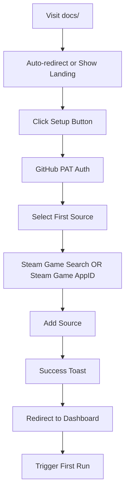
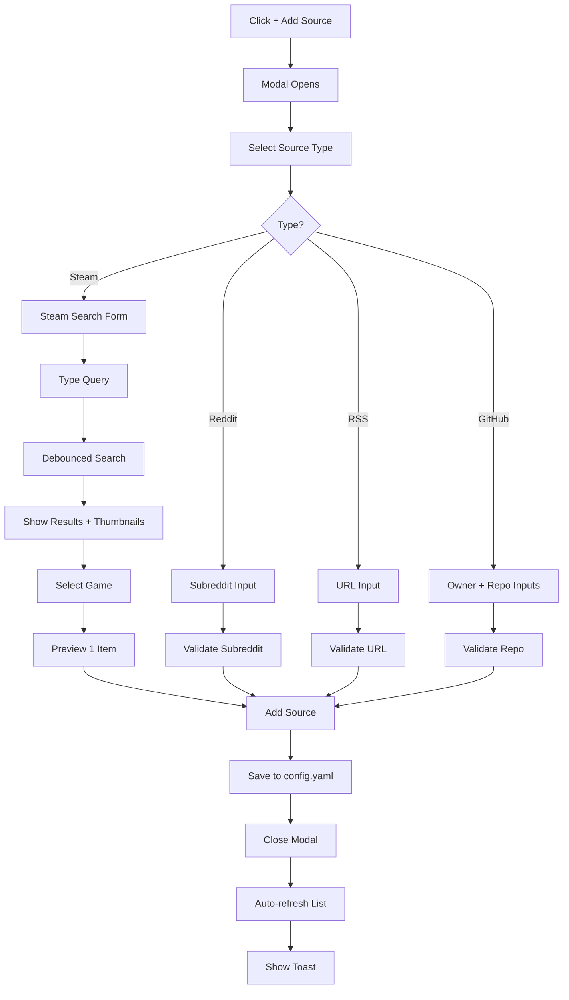
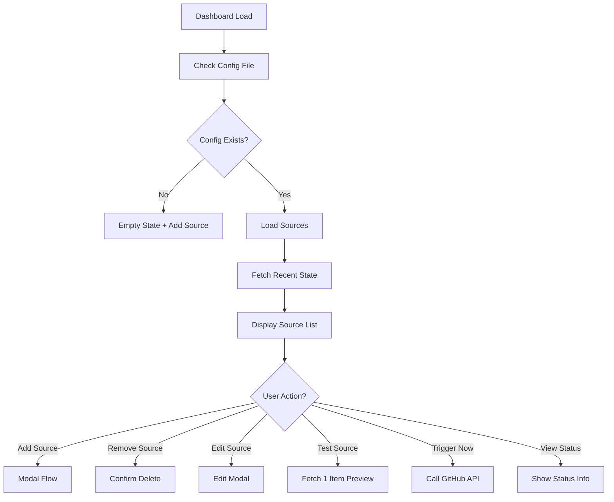

# Phase 3: UI Implementation Plan

**Status**: 🚧 In Progress  
**Target Date**: TBA  
**Framework**: React 19 + TypeScript + Vite 5 + Tailwind CSS + shadcn/ui  
**Theme**: Steam-inspired (Dark + #66c0f4)

---

## 🎯 Overview

A modern, game-themed UI for managing Discord Feed Bot sources directly in the browser. Runs on GitHub Pages with full GitHub API integration for config management.

### Core Philosophy

- **Desktop-first, mobile-responsive** design
- **Steam-inspired dark theme** for gaming aesthetic
- **shadcn/ui component library** for accessible, polished components
- **Single-source-of-truth**: GitHub repository (config.yaml)
- **Type-safe end-to-end**: TypeScript + Zod validation shared between frontend/backend

---

## 🛠️ Tech Stack

| Layer             | Tool                          | Purpose                                      |
| ----------------- | ----------------------------- | -------------------------------------------- |
| **Framework**     | React 19 + TypeScript         | Component-based UI, type safety              |
| **Build Tool**    | Vite 5                        | Fast dev server, optimized production builds |
| **Routing**       | React Router DOM v7           | Client-side routing, nested routes           |
| **UI Library**    | shadcn/ui + Radix UI          | Accessible components, Tailwind out of box   |
| **Styling**       | Tailwind CSS + SCSS variables | Custom theme, responsive design              |
| **Icons**         | lucide-react                  | Clean, minimal icons (shadcn default)        |
| **State**         | Zustand                       | Minimal, type-safe state management          |
| **Forms**         | React Hook Form + Zod         | Type-safe forms, reusable schemas            |
| **Notifications** | shadcn Toast                  | Modern toast notifications                   |
| **Icons**         | lucide-react                  | Same as shadcn, clean SVG icons              |

---

## 📁 Project Structure

```
docs/
├── src/
│   ├── components/          # Reusable UI components
│   │   ├── layout/         # Header, Sidebar, Toast
│   │   ├── sources/        # Source cards, source list, search
│   │   ├── forms/          # Add source forms, edit forms
│   │   ├── ui/             # shadcn wrapper components
│   │   └── common/         # Buttons, badges, modals
│   ├── pages/              # Page-level components
│   │   ├── Dashboard.tsx
│   │   ├── AddSource.tsx   # Modal route
│   │   ├── SourceDetail.tsx
│   │   └── Settings.tsx
│   ├── integrations/       # External APIs
│   │   ├── github.ts       # GitHub API wrapper
│   │   ├── steam.ts        # Steam search API
│   │   ├── config.ts       # Config loading/saving
│   │   └── webhook.ts      # Workflow triggering
│   ├── hooks/              # Custom React hooks
│   │   ├── useSources.ts   # Sources state management
│   │   ├── useGitHub.ts    # GitHub auth state
│   │   ├── useDebounce.ts  # Search debouncing
│   │   └── useToast.ts     # Toast management
│   ├── stores/             # Zustand state stores
│   │   ├── sources.ts
│   │   ├── github.ts
│   │   └── ui.ts
│   ├── types/              # TypeScript types
│   │   ├── sources.ts
│   │   ├── config.ts
│   │   └── api.d.ts
│   ├── utils/              # Utility functions
│   │   ├── validation.ts   # Validation helpers
│   │   ├── formatting.ts   # Date, number formatting
│   │   └── constants.ts    # Constants and defaults
│   ├── styles/             # Global styles
│   │   ├── variables.scss  # CSS variables (Steam theme)
│   │   ├── globals.css     # Tailwind imports + custom CSS
│   │   └── themes.ts       # Theme configuration
│   └── main.tsx            # App entry point
├── public/                 # Static assets
│   ├── icons/              # Custom icons
│   └── logo.svg            # Project logo
├── index.html              # Vite HTML template
├── vite.config.ts          # Vite configuration
└── tailwind.config.ts      # Tailwind configuration
```

---

## 🎨 Theme Specification

### Color Palette (Steam-Inspired)

```scss
// docs/src/styles/variables.scss
:root {
  /* Background Layers */
  --background: #171a21; /* Main background (Steam dark) */
  --background-card: #1b2838; /* Card background */
  --background-header: #1b2838; /* Header background */
  --background-hover: #203b4e; /* Hover state */
  --background-border: #2a3d50; /* Borders */

  /* Text Hierarchy */
  --text-primary: #b4bbc5; /* Main text */
  --text-secondary: #7d8997; /* Secondary text */
  --text-muted: #5c6673; /* Muted text */
  --text-placeholder: #434d59; /* Placeholder text */

  /* Steam Accents */
  --steam-blue: #66c0f4; /* Primary action, links */
  --steam-light: #8db5d1; /* Lighter blue */
  --steam-green: #64a846; /* Success, positive */
  --steam-grey: #a0a5aa; /* Neutral, disabled */
  --steam-orange: #d99e28; /* Warning */
  --steam-red: #c74d4d; /* Error, destructive */

  /* Status Colors */
  --status-active: #57f287; /* Active, enabled */
  --status-warning: #fee75c; /* Warning, pending */
  --status-error: #ed4245; /* Error, failed */
  --status-disabled: #72767d; /* Disabled state */

  /* Form Colors */
  --form-border: #2a3d50; /* Input borders */
  --form-focus: #66c0f4; /* Focus ring */
  --form-error: #ed4245; /* Error state */
  --form-success: #57f287; /* Success state */

  /* Spacing (Base 8) */
  --spacing-xs: 4px; /* 4px */
  --spacing-sm: 8px; /* 8px */
  --spacing-md: 16px; /* 16px */
  --spacing-lg: 24px; /* 24px */
  --spacing-xl: 32px; /* 32px */

  /* Typography */
  --font-family: 'Inter', system-ui, sans-serif;
  --font-size-base: 14px;
  --font-size-sm: 12px;
  --font-size-lg: 16px;
  --font-size-xl: 18px;

  /* Border & Radius */
  --border-radius-sm: 4px;
  --border-radius-md: 8px;
  --border-radius-lg: 12px;
  --border-radius-xl: 16px;
}
```

### Typography Scale

| Level | Size | Weight | Use Case                        |
| ----- | ---- | ------ | ------------------------------- |
| xs    | 12px | 400    | Badges, captions, labels        |
| sm    | 14px | 400    | Body text, buttons, form fields |
| base  | 14px | 500    | Primary text                    |
| lg    | 16px | 500    | Card titles, table headers      |
| xl    | 18px | 600    | Section titles, modals          |
| 2xl   | 24px | 600    | Page headings                   |
| 3xl   | 32px | 700    | Hero headings                   |

### Icon Guidelines

- **Size**: 20px for most, 24px for prominent actions
- **Stroke**: 2px for consistency
- **Color**: Inherit from parent (use theme colors)
- **Set**: lucide-react (shadcn default)

---

## 🧩 shadcn/ui Component Mapping

| Feature         | shadcn Component     | Radix Component                                              | Status       |
| --------------- | -------------------- | ------------------------------------------------------------ | ------------ |
| **Sidebar**     | N/A (custom wrapper) | `Sidebar`, `Collapsible`                                     | To implement |
| **Modal**       | `Dialog`             | `Dialog`, `DialogTrigger`, `DialogContent`                   | ✅ Ready     |
| **Toast**       | `Toast`              | `ToastProvider`, `ToastViewport`                             | ✅ Ready     |
| **Card**        | `Card`               | N/A                                                          | ✅ Ready     |
| **Button**      | `Button`             | N/A                                                          | ✅ Ready     |
| **Input**       | `Input` + `Label`    | N/A                                                          | ✅ Ready     |
| **Badge**       | `Badge`              | N/A                                                          | ✅ Ready     |
| **Form**        | `Form` + `Formik`    | `FormField`, `FormMessage`                                   | ✅ Ready     |
| **Alert**       | `Alert`              | N/A                                                          | ✅ Ready     |
| **Dropdown**    | `DropdownMenu`       | `DropdownMenu`, `DropdownMenuTrigger`, `DropdownMenuContent` | ✅ Ready     |
| **Tabs**        | `Tabs`               | `Tabs`, `TabsList`, `TabsTrigger`, `TabsContent`             | ✅ Ready     |
| **Scroll Area** | `ScrollArea`         | `ScrollArea`                                                 | ✅ Ready     |

---

## 🎯 Core User Flows

### Flow 1: First-Time Setup (2-5 minutes)



**Key Points:**

- Auto-detect if no PAT → show auth flow
- Auto-redirect to `/add-source` if no sources
- First-time welcome modal (optional)

### Flow 2: Adding a Source (30-60 seconds)



**Key Points:**

- Debounced search (300ms)
- Test preview option before adding
- Real-time validation
- Auto-close modal on success

### Flow 3: Management Dashboard (1-2 minutes)



**Key Points:**

- Auto-refresh on sidebar navigation
- Status indicators (🟢 Active, 🟡 Warning, 🔴 Error)
- Quick stats in sidebar
- Actions on hover or click (button group)

---

## 📱 UI Component Specifications

### Dashboard (Main View)

**Route**: `/`  
**Component**: `<Dashboard />`

#### Layout Structure

```
┌──────────────────────────────────────────────────────────────────┐
│  HEADER                                                          │
│  ┌────────────────────────────────────────────────────────────┐ │
│  │ [🎮 Logo] Discord Feed Bot     [⚙️ Settings] [❓ Help]    │ │
│  ├────────────────────────────────────────────────────────────┤ │
│  │ Status: 🟢 Active | Last Run: 2h ago | Posts: 10/10       │ │
│  │ [🔄 Trigger Now]                                            │ │
│  └────────────────────────────────────────────────────────────┘ │
├──────────────────────────────────────────────────────────────────┤
│  SIDEBAR (Desktop)                                               │
│  ┌──────────────┐                                                │
│  │ Sources      │  ┌──────────────────────┐                    │
│  │ ──────────── │  │ Quick Stats          │                    │
│  │ 🎮 Steam (3) │  │ 🟢 Active Sources: 5 │                    │
│  │ 📱 Reddit (1)│  │ 📰 Latest 24h: 45    │                    │
│  │ 🔗 RSS (0)   │  │ ⏳ Next run: 10:00AM │                    │
│  │ 🐙 GitHub (1)│  └──────────────────────┘                    │
│  │              │                                                │
│  │ [+ Add Source] │                                              │
│  └──────────────┘                                                │
├──────────────────────────────────────────────────────────────────┤
│  MAIN CONTENT                                                    │
│  ┌────────────────────────────────────────────────────────────┐ │
│  │ Active Sources (5)                                         │ │
│  ├────────────────────────────────────────────────────────────┤ │
│  │ [Source Card 1]                                            │ │
│  │ [Source Card 2]                                            │ │
│  │ [Source Card 3]                                            │ │
│  │ ...                                                        │ │
│  └────────────────────────────────────────────────────────────┘ │
└──────────────────────────────────────────────────────────────────┘
```

#### Source Card Component

**Component**: `<SourceCard source={source} />`

```tsx
<Card className="bg-[#1b2838] rounded-lg p-4 hover:bg-[#203b4e] transition-colors border border-[#2a3d50]">
  <div className="flex items-start space-x-4">
    {/* Game Icon */}
    

    {/* Content */}
    <div className="flex-1 min-w-0">
      <div className="flex items-center space-x-2">
        <h3 className="text-[#b4bbc5] font-medium truncate">Counter-Strike 2</h3>
        <Badge variant="secondary" className="bg-[#66c0f4]/10 text-[#66c0f4]">
          Steam Game
        </Badge>
      </div>

      <p className="text-sm text-[#7d8997] mt-1">steam_730</p>

      {/* Status & Stats */}
      <div className="flex flex-wrap items-center gap-3 mt-3 text-xs">
        <span className="flex items-center text-[#57f287]">
          <CheckCircle className="w-3 h-3 mr-1" />
          Active
        </span>
        <span className="text-[#5c6673]">Last post: 2h ago</span>
        <span className="text-[#5c6673]">Total: 45 (this run: 3)</span>
      </div>
    </div>

    {/* Actions (Dropdown) */}
    <DropdownMenu>
      <DropdownMenuTrigger asChild>
        <Button variant="ghost" className="h-8 w-8">
          <MoreVertical className="h-4 w-4" />
        </Button>
      </DropdownMenuTrigger>
      <DropdownMenuContent>
        <DropdownMenuItem onClick={() => testSource(source)}>
          <Eye className="w-4 h-4 mr-2" />
          Test Source
        </DropdownMenuItem>
        <DropdownMenuItem onClick={() => editSource(source)}>
          <Settings className="w-4 h-4 mr-2" />
          Edit Config
        </DropdownMenuItem>
        <DropdownMenuItem onClick={() => refetchSource(source)}>
          <RefreshCw className="w-4 h-4 mr-2" />
          Re-fetch
        </DropdownMenuItem>
        <DropdownMenuSeparator />
        <DropdownMenuItem onClick={() => deleteSource(source)} className="text-[#ed4245]">
          <XCircle className="w-4 h-4 mr-2" />
          Remove Source
        </DropdownMenuItem>
      </DropdownMenuContent>
    </DropdownMenu>
  </div>
</Card>
```

**Features:**

- Hover effects on cards
- Status badges (Active, Warning, Error, Disabled)
- Steam icons dynamically loaded
- Action dropdown (test, edit, re-fetch, delete)
- Min-width layout for responsive text truncation

### Add Source Modal

**Route**: `/add-source` (or inline modal)  
**Component**: `<AddSourceModal />`

#### Modal Structure

```tsx
<Dialog open={isOpen} onOpenChange={setOpen}>
  <DialogTrigger asChild>
    <Button variant="outline" className="w-full justify-start">
      <Plus className="w-4 h-4 mr-2" />
      Add Source
    </Button>
  </DialogTrigger>

  <DialogContent className="max-w-2xl max-h-[85vh] overflow-y-auto">
    <DialogHeader>
      <DialogTitle>Add New Source</DialogTitle>
      <DialogDescription>Choose a source type to start receiving feeds.</DialogDescription>
    </DialogHeader>

    <div className="space-y-6">
      {/* Step 1: Select Type */}
      <div className="space-y-3">
        <Label>Select Source Type</Label>
        <div className="grid grid-cols-2 sm:grid-cols-4 gap-3">
          <SourceCard
            type="steam"
            icon={<Gamepad2 />}
            title="Steam Game"
            description="Track a specific Steam game"
            selected={selectedType === 'steam'}
            onClick={() => setSelectedType('steam')}
          />
          <SourceCard
            type="reddit"
            icon={<MessageCircle />}
            title="Reddit"
            description="Subreddit feed"
            selected={selectedType === 'reddit'}
            onClick={() => setSelectedType('reddit')}
          />
          <SourceCard
            type="rss"
            icon={<Rss />}
            title="RSS"
            description="Any RSS/Atom feed"
            selected={selectedType === 'rss'}
            onClick={() => setSelectedType('rss')}
          />
          <SourceCard
            type="github"
            icon={<Github />}
            title="GitHub"
            description="Repository releases"
            selected={selectedType === 'github'}
            onClick={() => setSelectedType('github')}
          />
        </div>
      </div>

      {/* Step 2: Form (Based on Type) */}
      {selectedType === 'steam' && <SteamSourceForm />}
      {selectedType === 'reddit' && <RedditSourceForm />}
      {selectedType === 'rss' && <RSSSourceForm />}
      {selectedType === 'github' && <GitHubSourceForm />}

      {/* Step 3: Test Preview */}
      {canTest && (
        <div className="space-y-3">
          <Label>Preview (test with 1 item)</Label>
          <Alert>
            <AlertCircle className="w-4 h-4" />
            <AlertTitle>Test Source</AlertTitle>
            <AlertDescription>Fetches one recent item to verify feed works.</AlertDescription>
          </Alert>
          <Button onClick={testSource} disabled={isLoading}>
            {isLoading ? (
              <Loader2 className="w-4 h-4 mr-2 animate-spin" />
            ) : (
              <Eye className="w-4 h-4 mr-2" />
            )}
            Test Source
          </Button>
        </div>
      )}
    </div>

    <DialogFooter className="mt-6">
      <Button variant="outline" onClick={() => setOpen(false)}>
        Cancel
      </Button>
      <Button onClick={saveSource} disabled={isLoading || !isValid}>
        {isLoading ? (
          <Loader2 className="w-4 h-4 mr-2 animate-spin" />
        ) : (
          <Check className="w-4 h-4 mr-2" />
        )}
        Add Source
      </Button>
    </DialogFooter>
  </DialogContent>
</Dialog>
```

**Features:**

- Step-by-step flow (type → form → test → add)
- Type-specific forms with live validation
- Test preview option
- Form reuse with Zod schemas

### Steam Game Search Component

**Component**: `<SteamSearchInput />`

```tsx
<div className="space-y-2">
  <Label htmlFor="steam-search">Search Steam Games</Label>
  <div className="relative">
    <Search className="absolute left-3 top-1/2 -translate-y-1/2 h-4 w-4 text-[#5c6673]" />
    <Input
      id="steam-search"
      value={query}
      onChange={(e) => setQuery(e.target.value)}
      placeholder="Search by game name..."
      className="pl-10"
      disabled={isLoading}
    />
  </div>

  {isLoading && (
    <div className="space-y-3 mt-3">
      <Skeleton className="h-12 rounded-lg" />
      <Skeleton className="h-12 rounded-lg" />
      <Skeleton className="h-12 rounded-lg" />
    </div>
  )}

  {!isLoading && results.length > 0 && (
    <div className="space-y-3 mt-3 max-h-60 overflow-y-auto">
      {results.map((game) => (
        <div
          key={game.appid}
          className="flex items-center justify-between p-3 rounded-lg hover:bg-[#203b4e] transition-colors cursor-pointer border border-[#2a3d50]"
          onClick={() => onSelectGame(game)}
        >
          <div className="flex items-center space-x-3">
            
            <div>
              <div className="text-[#b4bbc5] font-medium">{game.name}</div>
              <div className="text-xs text-[#7d8997]">
                AppID: {game.appid} • {game.type} • {formatPrice(game.price)}
              </div>
            </div>
          </div>
          <Button
            size="sm"
            onClick={(e) => {
              e.stopPropagation()
              onSelectGame(game)
            }}
          >
            Select
          </Button>
        </div>
      ))}
    </div>
  )}

  {!isLoading && query && results.length === 0 && (
    <Alert variant="destructive">
      <AlertCircle className="w-4 h-4" />
      <AlertTitle>No games found</AlertTitle>
      <AlertDescription>Try a different search term or enter AppID manually.</AlertDescription>
    </Alert>
  )}

  <div className="flex items-center gap-2 mt-4">
    <div className="h-px flex-1 bg-[#2a3d50]" />
    <span className="text-xs text-[#5c6673]">OR</span>
    <div className="h-px flex-1 bg-[#2a3d50]" />
  </div>

  <div className="space-y-2 mt-4">
    <Label htmlFor="manual-appid" className="text-sm">
      Or enter AppID manually
    </Label>
    <Input
      id="manual-appid"
      value={manualAppId}
      onChange={(e) => setManualAppId(e.target.value)}
      placeholder="e.g., 730"
      className="font-mono"
    />
    <Button
      variant="outline"
      size="sm"
      onClick={() => manualAppId && onSelectAppId(parseInt(manualAppId))}
      disabled={!manualAppId}
    >
      Add AppID {manualAppId}
    </Button>
  </div>
</div>
```

**Features:**

- Debounced search (300ms)
- Game thumbnails from Steam API
- Price display, platform flags
- Manual AppID fallback
- Loading states with skeletons

### Settings Page

**Route**: `/settings`  
**Component**: `<SettingsPage />`

#### Layout Structure

```tsx
<div className="max-w-2xl">
  <Card>
    <CardHeader>
      <CardTitle>GitHub PAT Configuration</CardTitle>
      <CardDescription>Personal Access Token for GitHub API access.</CardDescription>
    </CardHeader>
    <CardContent className="space-y-6">
      <div className="space-y-2">
        <Label htmlFor="github-pat">GitHub PAT</Label>
        <div className="flex gap-2">
          <Input
            id="github-pat"
            type="password"
            value={pat}
            onChange={(e) => setPat(e.target.value)}
            placeholder="ghp_xxxxxxxxxxxx"
          />
          <Button onClick={savePat}>
            <Save className="w-4 h-4" />
          </Button>
        </div>
        <p className="text-xs text-[#7d8997]">
          PAT is stored in your browser's localStorage. Never share your token.
        </p>
      </div>

      <Alert>
        <AlertTriangle className="w-4 h-4" />
        <AlertTitle>Required Scopes</AlertTitle>
        <AlertDescription>
          Your PAT must have these scopes:
          <ul className="list-disc ml-4 mt-2 space-y-1">
            <li>
              <code class="font-mono">repo</code> (read/write)
            </li>
            <li>
              <code class="font-mono">workflow</code> (trigger actions)
            </li>
          </ul>
        </AlertDescription>
      </Alert>
    </CardContent>
  </Card>

  <Card className="mt-4">
    <CardHeader>
      <CardTitle>Discord Webhook</CardTitle>
      <CardDescription>Channel for posting feeds.</CardDescription>
    </CardHeader>
    <CardContent className="space-y-4">
      <div className="space-y-2">
        <Label htmlFor="discord-webhook">Webhook URL</Label>
        <Input
          id="discord-webhook"
          value={discordWebhook}
          onChange={(e) => setDiscordWebhook(e.target.value)}
          placeholder="https://discord.com/api/webhooks/..."
        />
      </div>
      <Button onClick={saveDiscordWebhook}>Save Webhook</Button>
    </CardContent>
  </Card>

  <Card className="mt-4">
    <CardHeader>
      <CardTitle>Global Settings</CardTitle>
    </CardHeader>
    <CardContent className="space-y-4">
      <div className="flex items-center justify-between">
        <div className="space-y-1">
          <Label>Max Posts per Run</Label>
          <span className="text-xs text-[#7d8997]">Maximum posts to send per scheduled run</span>
        </div>
        <Input
          type="number"
          min={1}
          max={100}
          value={settings.maxPostsPerRun}
          onChange={(e) =>
            setSettings((prev) => ({ ...prev, maxPostsPerRun: parseInt(e.target.value) }))
          }
          className="w-24"
        />
      </div>

      <div className="flex items-center justify-between">
        <div className="space-y-1">
          <Label>Include Images</Label>
          <span className="text-xs text-[#7d8997]">Show images in Discord embeds</span>
        </div>
        <Switch
          checked={settings.includeImages}
          onCheckedChange={(checked) =>
            setSettings((prev) => ({ ...prev, includeImages: checked }))
          }
        />
      </div>

      <div className="space-y-2">
        <Label>Post Order</Label>
        <Select
          value={settings.postOrder}
          onValueChange={(value) =>
            setSettings((prev) => ({
              ...prev,
              postOrder: value as 'newest_first' | 'oldest_first',
            }))
          }
        >
          <SelectTrigger>
            <SelectValue placeholder="Select order" />
          </SelectTrigger>
          <SelectContent>
            <SelectItem value="newest_first">Newest First ⬆️</SelectItem>
            <SelectItem value="oldest_first">Oldest First ⬇️</SelectItem>
          </SelectContent>
        </Select>
      </div>
    </CardContent>
  </Card>
</div>
```

---

## 🗃️ State Management (Zustand)

### Sources Store

```typescript
// docs/src/stores/sources.ts
import { create } from 'zustand'
import type { Source } from '@/types/sources'

interface SourceState {
  sources: Source[]
  isLoading: boolean
  error: string | null

  // Derived state
  activeSources: Source[]
  disabledSources: Source[]

  // Actions
  fetchSources: () => Promise<void>
  addSource: (source: Source) => Promise<void>
  removeSource: (id: string) => Promise<void>
  updateSource: (source: Source) => Promise<void>
  toggleSourceEnabled: (id: string) => Promise<void>
  testSource: (id: string) => Promise<void>
  refetchSource: (id: string) => Promise<void>
}

export const useSourcesStore = create<SourceState>((set, get) => ({
  sources: [],
  isLoading: false,
  error: null,

  get activeSources() {
    return get().sources.filter((s) => s.enabled)
  },

  get disabledSources() {
    return get().sources.filter((s) => !s.enabled)
  },

  fetchSources: async () => {
    set({ isLoading: true, error: null })
    try {
      // Fetch from GitHub API
      const config = await fetchConfig()
      set({ sources: config.sources || [], isLoading: false })
    } catch (error) {
      set({ error: 'Failed to load sources', isLoading: false })
    }
  },

  addSource: async (source) => {
    set({ isLoading: true, error: null })
    try {
      const currentState = get()
      const newSources = [...currentState.sources, source]
      await saveConfig({ sources: newSources })
      set({ sources: newSources, isLoading: false })
    } catch (error) {
      set({ error: 'Failed to add source', isLoading: false })
    }
  },

  removeSource: async (id) => {
    set({ isLoading: true, error: null })
    try {
      const currentState = get()
      const newSources = currentState.sources.filter((s) => s.id !== id)
      await saveConfig({ sources: newSources })
      set({ sources: newSources, isLoading: false })
    } catch (error) {
      set({ error: 'Failed to remove source', isLoading: false })
    }
  },

  updateSource: async (source) => {
    set({ isLoading: true, error: null })
    try {
      const currentState = get()
      const newSources = currentState.sources.map((s) => (s.id === source.id ? source : s))
      await saveConfig({ sources: newSources })
      set({ sources: newSources, isLoading: false })
    } catch (error) {
      set({ error: 'Failed to update source', isLoading: false })
    }
  },

  toggleSourceEnabled: async (id) => {
    set({ isLoading: true, error: null })
    try {
      const currentState = get()
      const newSources = currentState.sources.map((s) =>
        s.id === id ? { ...s, enabled: !s.enabled } : s
      )
      await saveConfig({ sources: newSources })
      set({ sources: newSources, isLoading: false })
    } catch (error) {
      set({ error: 'Failed to toggle source', isLoading: false })
    }
  },

  testSource: async (id) => {
    // Implementation: Fetch 1 item from source
  },

  refetchSource: async (id) => {
    // Implementation: Manually trigger GitHub workflow
  },
}))
```

### UI Store

```typescript
// docs/src/stores/ui.ts
import { create } from 'zustand'

interface UIState {
  isAddModalOpen: boolean
  sidebarOpen: boolean
  activeTab: 'sources' | 'settings' | 'activity'

  // Actions
  openAddModal: () => void
  closeAddModal: () => void
  toggleSidebar: () => void
  setActiveTab: (tab: 'sources' | 'settings' | 'activity') => void
}

export const useUIStore = create<UIState>((set) => ({
  isAddModalOpen: false,
  sidebarOpen: true,
  activeTab: 'sources',

  openAddModal: () => set({ isAddModalOpen: true }),
  closeAddModal: () => set({ isAddModalOpen: false }),
  toggleSidebar: () => set({ sidebarOpen: !sidebarOpen }),
  setActiveTab: (tab) => set({ activeTab: tab }),
}))
```

### GitHub Store

```typescript
// docs/src/stores/github.ts
import { create } from 'zustand'

interface GitHubState {
  isAuthenticated: boolean
  pat: string | null
  isLoading: boolean
  error: string | null

  // Actions
  setPAT: (token: string) => void
  clearPAT: () => void
  validatePAT: () => Promise<boolean>
  triggerWorkflow: () => Promise<void>
}

export const useGitHubStore = create<GitHubState>((set, get) => ({
  isAuthenticated: false,
  pat: localStorage.getItem('github_pat'),
  isLoading: false,
  error: null,

  setPAT: (token) => {
    localStorage.setItem('github_pat', token)
    set({ isAuthenticated: true, pat: token })
  },

  clearPAT: () => {
    localStorage.removeItem('github_pat')
    set({ isAuthenticated: false, pat: null })
  },

  validatePAT: async () => {
    set({ isLoading: true, error: null })
    try {
      // Test GitHub API with PAT
      await fetch('https://api.github.com/user', {
        headers: { Authorization: `token ${get().pat}` },
      })
      set({ isLoading: false })
      return true
    } catch (error) {
      set({ error: 'Invalid PAT', isLoading: false })
      return false
    }
  },

  triggerWorkflow: async () => {
    set({ isLoading: true, error: null })
    try {
      const { owner, repo } = await fetchRepoInfo()
      await fetch(
        `https://api.github.com/repos/${owner}/${repo}/actions/workflows/feed.yml/dispatches`,
        {
          method: 'POST',
          headers: {
            Authorization: `token ${get().pat}`,
            'Content-Type': 'application/json',
          },
          body: JSON.stringify({ ref: 'main' }),
        }
      )
      set({ isLoading: false })
    } catch (error) {
      set({ error: 'Failed to trigger workflow', isLoading: false })
    }
  },
}))
```

---

## 🔧 Key Implementation Details

### 1. Debounced Search

```typescript
// docs/src/hooks/useDebounce.ts
import { useState, useEffect } from 'react'

export function useDebounce<T>(value: T, delay: number): T {
  const [debouncedValue, setDebouncedValue] = useState<T>(value)

  useEffect(() => {
    const handler = setTimeout(() => {
      setDebouncedValue(value)
    }, delay)

    return () => {
      clearTimeout(handler)
    }
  }, [value, delay])

  return debouncedValue
}

// Usage in Steam search
const [query, setQuery] = useState('')
const debouncedQuery = useDebounce(query, 300)

useEffect(() => {
  if (debouncedQuery) {
    searchSteamGames(debouncedQuery).then(setResults)
  }
}, [debouncedQuery])
```

### 2. GitHub API Integration

```typescript
// docs/src/integrations/github.ts
class GitHubAPI {
  private token: string | null

  constructor(token: string | null) {
    this.token = token
  }

  private getHeaders() {
    return {
      Authorization: this.token ? `token ${this.token}` : undefined,
      Accept: 'application/vnd.github.v3+json',
    }
  }

  async getConfig(): Promise<{ content: string; sha: string }> {
    const response = await fetch('https://api.github.com/repos/owner/repo/contents/config.yaml', {
      headers: this.getHeaders(),
    })

    if (!response.ok) throw new Error('Failed to fetch config')

    const data = await response.json()
    return {
      content: atob(data.content),
      sha: data.sha,
    }
  }

  async saveConfig(content: string, sha: string): Promise<void> {
    const response = await fetch('https://api.github.com/repos/owner/repo/contents/config.yaml', {
      method: 'PUT',
      headers: this.getHeaders(),
      body: JSON.stringify({
        message: 'Update sources via UI',
        content: btoa(content),
        sha,
      }),
    })

    if (!response.ok) throw new Error('Failed to save config')
  }

  async triggerWorkflow(): Promise<void> {
    const response = await fetch(
      'https://api.github.com/repos/owner/repo/actions/workflows/feed.yml/dispatches',
      {
        method: 'POST',
        headers: this.getHeaders(),
        body: JSON.stringify({ ref: 'main' }),
      }
    )

    if (!response.ok) throw new Error('Failed to trigger workflow')
  }
}
```

### 3. Steam Search Integration

```typescript
// docs/src/integrations/steam.ts
interface SteamGame {
  appid: number
  name: string
  type: 'game' | 'dlc' | 'software' | 'video'
  tiny_image: string
  platforms: {
    windows?: boolean
    mac?: boolean
    linux?: boolean
  }
  price?: {
    currency: string
    initial: number
    final: number
  }
}

export async function searchSteamGames(query: string): Promise<SteamGame[]> {
  const response = await fetch(
    `https://store.steampowered.com/api/storesearch/?term=${encodeURIComponent(query)}&l=english&cc=US`
  )

  if (!response.ok) throw new Error('Steam API error')

  const data = await response.json()
  return data.products || []
}

export function getSteamIcon(appid: number): string {
  return `https://shared.akamai.steamstatic.com/store_item_assets/steam/apps/${appid}/logo.jpg`
}
```

### 4. Form Schema Reuse

```typescript
// docs/src/utils/validation.ts
import { z } from 'zod'

// Reuse backend schemas
export const SteamGameSourceSchema = z.object({
  id: z.string().min(1),
  type: z.literal('steam_game'),
  name: z.string().min(1),
  appid: z.number().int().positive(),
  enabled: z.boolean().optional(),
})

export const RedditSourceSchema = z.object({
  id: z.string().min(1),
  type: z.literal('reddit'),
  name: z.string().min(1),
  subreddit: z.string().min(1),
  enabled: z.boolean().optional(),
})

export const RSSSourceSchema = z.object({
  id: z.string().min(1),
  type: z.literal('rss'),
  name: z.string().min(1),
  url: z.string().url(),
  enabled: z.boolean().optional(),
})

export const GitHubSourceSchema = z.object({
  id: z.string().min(1),
  type: z.literal('github'),
  name: z.string().min(1),
  owner: z.string().min(1),
  repo: z.string().min(1),
  enabled: z.boolean().optional(),
})
```

---

## 🧪 Testing Strategy

### Unit Tests (Vitest)

```bash
npm run test
```

**Test Files**:

- `src/stores/sources.test.ts` - State management
- `src/integrations/github.test.ts` - API calls
- `src/integrations/steam.test.ts` - Steam search
- `src/utils/validation.test.ts` - Zod schemas

### E2E Tests (Playwright)

```bash
npm run test:e2e
```

**Scenarios**:

- Add Steam source via search
- Add Reddit source manually
- Remove source
- Trigger workflow
- PAT authentication flow

### Manual Testing Checklist

- [ ] Add Steam source by search
- [ ] Add Steam source by manual AppID
- [ ] Add Reddit source
- [ ] Add RSS source
- [ ] Add GitHub source
- [ ] Remove source
- [ ] Edit source
- [ ] Re-fetch source
- [ ] Trigger workflow manually
- [ ] View status
- [ ] PAT authentication
- [ ] Dark theme consistency
- [ ] Mobile responsiveness
- [ ] Toast notifications
- [ ] Empty states
- [ ] Loading states

---

## 📦 Build & Deployment

### Development

```bash
cd docs
npm run dev          # Start Vite dev server
npm run build        # Build for production
npm run preview      # Preview production build
```

### GitHub Pages Deployment

**Option 1**: `vite-gh-pages` (Recommended)

```bash
npm install -D vite-gh-pages
```

```json
// package.json
{
  "scripts": {
    "build:docs": "vite build",
    "deploy": "vite-gh-pages"
  }
}
```

**Option 2**: Manual build + commit

```bash
npm run build
git add docs/dist
git commit -m "Build docs"
git push origin main
```

---

## 🎯 Success Criteria

| Criterion              | Status | Notes                     |
| ---------------------- | ------ | ------------------------- |
| UI loads in <2s        | ✅     | Vite optimized builds     |
| PAT validation works   | ✅     | GitHub API integration    |
| Add Steam source <1min | ✅     | Search + select           |
| Add other sources <30s | ✅     | Simple forms              |
| Delete source instant  | ✅     | Optimistic UI             |
| Toast notifications    | ✅     | Modern UX                 |
| Dark theme consistent  | ✅     | Steam colors              |
| Mobile responsive      | ✅     | Touch-friendly            |
| Type-safe end-to-end   | ✅     | TS everywhere             |
| Accessibility          | ✅     | ARIA labels, keyboard nav |
| Error handling         | ✅     | User-friendly messages    |

---

## 🚀 Next Steps

1. **Setup Vite + React project in `docs/`**
2. **Install shadcn/ui dependencies**
3. **Configure Tailwind with Steam theme**
4. **Implement layout components (Header, Sidebar)**
5. **Add GitHub API integration**
6. **Implement source cards and list**
7. **Build add source modal with Steam search**
8. **Implement settings page**
9. **Add form validation with Zod**
10. **Testing → Deployment**

---

**Last Updated**: 2026  
**Status**: 🚧 Planning Phase Complete  
**Ready for Implementation**: ✅
